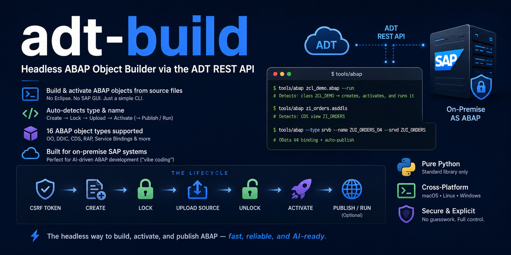
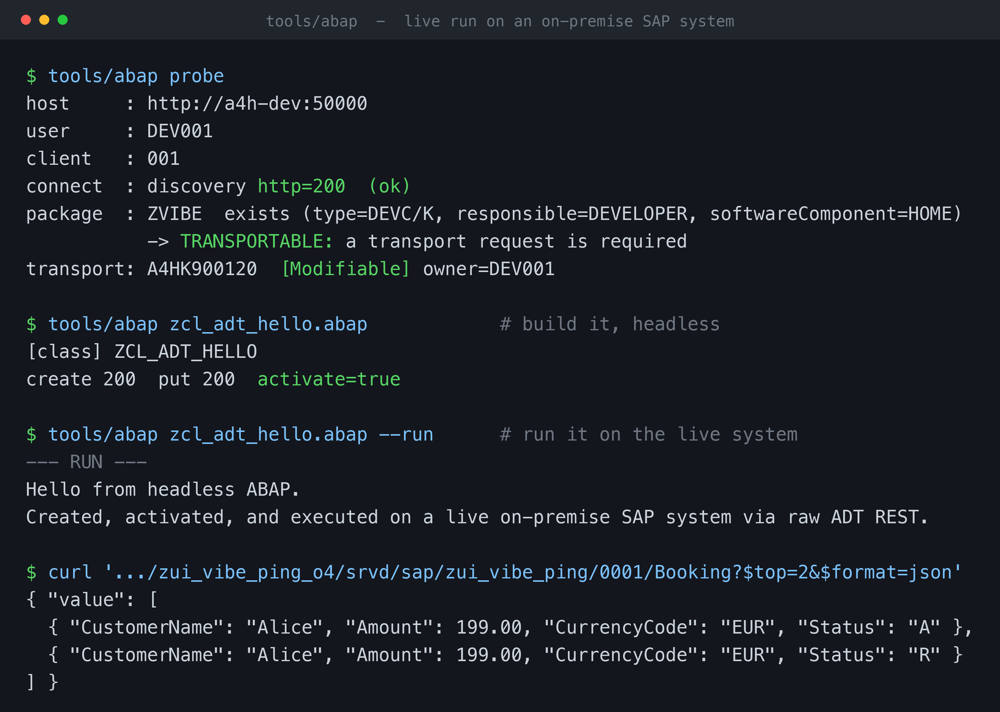

# adt-build

**English** · [한국어](README.ko.md)



> **Headless ABAP object builder via the ADT REST API — built for AI-driven ABAP development ("vibe coding") on on-premise SAP systems, reached over plain ADT REST + basic auth. Build, activate, publish, and verify (ABAP Unit · ATC · ABAP Doc) — no Eclipse, no binary, no MCP.**

A headless CLI tool to build and activate ABAP objects directly from source files using the ADT REST API—no Eclipse, no SAP GUI required.

With a single command, adt-build automatically detects the object's type and name, then handles the entire lifecycle: Create → Lock → Upload Source → Activate. It can even execute classruns, publish service bindings, and — unusual for a tool this small — close the **verify loop** right after activation: ABAP Unit (`--test`), ATC static checks (`--atc`), and ABAP Doc coverage (`--doc`), all over HTTP(S). It supports 16 ABAP object types, including everything needed to expose a RAP service as a live OData V4 endpoint.

```bash
tools/abap zcl_demo.abap --run     # Detects: class ZCL_DEMO → creates, activates, and runs it
tools/abap zi_orders.asddls        # Detects: CDS view ZI_ORDERS
tools/abap --type srvb --name ZUI_ORDERS_O4 --srvd ZUI_ORDERS   # OData V4 binding + auto-publish
tools/abap zcl_demo.abap --test --atc --doc   # build, then ABAP Unit + ATC + ABAP Doc coverage
```

## 💡 Why adt-build?

The standard way to create and activate ABAP objects is via Eclipse ADT or SAP GUI. However, these GUI-based tools become bottlenecks when you want to:

- Automate object creation in CI/CD pipelines.
- Delegate ABAP development to AI coding agents.
- Work remotely without VPN access to the corporate LAN.
- Get things done with zero heavy installations (requires only Python 3 and standard libraries).

Under the hood, ADT is just a REST API. This tool interacts with it directly, abstracting away the undocumented quirks and per-object complexities—such as media types, creation payloads, service-binding publish steps, and RAP mass-activations. (For deep technical details, see [REFERENCE.md](REFERENCE.md)).

**Sweet spot: on-premise AS ABAP.** SAP's *official* ADT-for-VS-Code / MCP tooling targets ABAP Cloud, so it doesn't reach on-premise systems. Community tools do — notably the VSP MCP server, which can create, activate, and publish on-premise objects too. So adt-build isn't "the only way to write"; what it adds is *form factor*: a single dependency-free Python file (standard library only, no binary to install or vet, a few hundred lines you can read in one sitting) that an AI agent or a CI step can call directly — no Eclipse, no Cloud, no MCP required.

## 🚀 Installation

You only need Python 3 (it strictly uses the standard library; no `pip install` is required). Bash and curl are only needed if you plan to use the optional fallback script.

```bash
git clone <this-repo> && cd adt-build
cp .env.example .env      # Fill in your system details and credentials
```

**.env Configuration:**

```ini
SAP_URL=http://your-host:50000
SAP_USER=DEVELOPER
SAP_PASSWORD=...
SAP_CLIENT=001
SAP_PACKAGE=ZLOCAL
SAP_TRANSPORT=            # Leave empty for local ($TMP) packages
```

- **User Requirements:** The user must have a non-initial SU01 password (log in once via SAP GUI to clear the "change on first logon" prompt).
- **System Requirements:** ADT must be active on the system (transaction `SICF` → `/sap/bc/adt`).

### ⚙️ System Port Configuration

The port in `SAP_URL` is not fixed; it depends on your system's ICM configuration. If your instance number is `nn`, common values are:

- HTTP: `50000` (`5nn00`) or `8000` (`80nn`)
- HTTPS: `50001` (`5nn01`) or `44300` (`443nn`)

> **Tip:** You can find your exact port in transaction `SMICM` → Goto → Services, or by checking the `icm/server_port_*` parameters in the instance profile. When connecting over the internet, prefer HTTPS (use the `--insecure` flag if your dev system uses self-signed certificates).

## 💻 Usage

Simply run `tools/abap <file>`. The tool infers the object type from the file extension and the first line of code, and extracts the object name directly from the declaration.

### 📦 Supported Objects & Auto-Detection (16 Types)

| You write (Source code) | Extension | Detected As |
|---|---|---|
| `CLASS zcl_x DEFINITION ...` | `.abap` | Class `ZCL_X` |
| `INTERFACE zif_x ...` | `.abap` | Interface `ZIF_X` |
| `REPORT zr_x.` | `.abap` | Program `ZR_X` |
| `define structure zs_x ...` | `.asddls` | DDIC Structure `ZS_X` |
| `<doma:domain ...>` | `.xml` | Domain |
| `define view entity ZI_X ...` | `.asddls` | CDS View `ZI_X` |
| `define behavior for ZI_X ...` | `.asbdef` | Behavior Definition |
| `define service ZUI_X { ... }` | `.assrvd` | Service Definition |

> (Also supports: Function Groups, Function Modules, Tables, Data Elements, Type Groups, DCL, XSLT, and Service Bindings.)

### 🛠 Useful Flags

- `--run`: Execute a class via classrun after activation.
- `--test`: Run ABAP Unit on the object after activation (reports test methods + failures).
- `--atc`: Run ATC static checks after activation (reports findings by priority).
- `--doc`: Report ABAP Doc coverage of the public API (which methods still lack `"!` documentation).
- `--group ZFG`: Specify the function group for a function module.
- `--srvd ZX`: Specify the service definition for a service binding.
- `--type` / `--name`: Override automatic detection, or use for objects without source files.
- `--src`: Explicitly define the source file to upload.
- `--host` / `--user` / `--client` / `--package` / `--transport`: Override variables defined in `.env`.
- `--insecure`: Skip TLS certificate verification (for dev systems with self-signed certs).
- `--atc-max-prio N`: ATC gate threshold — fail on findings at priority 1..N (default 2; P3 advisory).
- `--verbose`: Dump the raw server response body on errors (helps debug non-XML error responses).

**Exit codes** (CI / agent loops): `0` pass · `1` compile/activate · `2` ABAP Unit · `3` ATC — so an agent can `tools/abap x --test --atc && <next step>`. `--doc` is advisory (never gates). An `activationExecuted="false"` with **no** error message = unchanged source = **pass**, not a failure (the one A4H nuance the gate encodes).

### 🎯 Example: CDS View to Live OData V4 (End-to-End)

```bash
# 1. Create CDS view
tools/abap zi_orders.asddls

# 2. Create Service definition
tools/abap zui_orders.assrvd

# 3. Create Binding + Auto-publish
tools/abap --type srvb --name ZUI_ORDERS_O4 --srvd ZUI_ORDERS

# → Success! GET /sap/opu/odata4/sap/zui_orders_o4/srvd/sap/zui_orders/0001/Orders now returns live JSON
```

## ✅ Live run (real output)

Every line below is actual output from running adt-build against a live on-premise SAP system. Only the host is masked.



<details>
<summary>Copy-paste version</summary>

```console
$ tools/abap probe
host     : http://a4h-dev:50000
user     : DEV001
client   : 001
connect  : discovery http=200  (ok)
package  : ZVIBE  exists (type=DEVC/K, responsible=DEVELOPER, softwareComponent=HOME)
           -> TRANSPORTABLE: a transport request is required
transport: A4HK900120  [Modifiable] owner=DEV001

$ tools/abap zcl_adt_hello.abap            # build it, headless
[class] ZCL_ADT_HELLO
create 200  put 200  activate=true

$ tools/abap zcl_adt_hello.abap --run      # run it on the live system
--- RUN ---
Hello from headless ABAP.
Created, activated, and executed on a live on-premise SAP system via raw ADT REST.

$ curl '.../zui_vibe_ping_o4/srvd/sap/zui_vibe_ping/0001/Booking?$top=2&$format=json'
{
  "value": [
    { "CustomerName": "Alice", "Amount": 199.00, "CurrencyCode": "EUR", "Status": "A" },
    { "CustomerName": "Alice", "Amount": 199.00, "CurrencyCode": "EUR", "Status": "R" }
  ]
}
```

</details>

## 🛑 No Guesswork: Explicit Configuration

System-specific values (port, client, package, transport) vary wildly. adt-build never hardcodes these or relies on silent fallbacks:

- The port is explicitly taken from your `SAP_URL`.
- The client is omitted from the header unless `SAP_CLIENT` is set (forcing the server to use your logon default).
- Package and transport values are strictly validated against the live system, never guessed.

Use `abap probe` to see exactly how the tool will interact with the system before executing a build:

```
$ abap probe
host     : https://your-host:50001
user     : DEVELOPER
client   : (omitted -> server logon default)
connect  : discovery http=200  (ok)
package  : ZLOCAL  exists (type=DEVC/K, responsible=DEVELOPER, softwareComponent=HOME)
           -> TRANSPORTABLE: a transport request is required
transport: ABCK900123  [Modifiable] owner=DEVELOPER
```

Because `.env` variables are standing configurations, they might not fit your current task. For AI-driven workflows, the agent should always confirm the scope upfront (e.g., Which package? Local or transportable?), use `probe` to verify the live state, and then execute the build.

## 🔍 How It Works

For every object, the tool executes the following lifecycle:

Fetch CSRF token → POST create (stateful session) → LOCK → PUT source (or object XML) → UNLOCK → POST activate in a fresh session (since the lock/PUT rotates the token).

Service bindings have an extra publish step, and classes optionally execute. With `--test`/`--atc`/`--doc` it then runs ABAP Unit, ATC, and an ABAP Doc coverage check against the just-activated object — the same verify loop you'd run in Eclipse, headless. Full per-type endpoints and media types are in [REFERENCE.md](REFERENCE.md).

**Two implementations:**

- **`tools/abap` (Primary):** Pure Python (standard library only). Features auto-detection and a robust type registry. Runs seamlessly on macOS, Linux, and Windows (use `py tools\abap ...` or the bundled `abap.cmd`). Verified on macOS/Linux; Windows is supported by design but not yet tested on a Windows host.
- **`tools/build.sh` (Fallback):** A Bash + Curl script that serves as a transparent reference implementation. (Unix only; use WSL or Git Bash on Windows).

## 🤝 Use Cases & Integrations

adt-build intentionally focuses on one job: the build step (create, activate, publish). It works great standalone, but shines in automated workflows:

- **AI Agents (e.g., Claude Code, Cursor):** An agent can write the source code, invoke the CLI to build it, and read the results in a continuous loop.
- **Coupling with MCP Servers:** A full ADT MCP server like VSP already does the whole lifecycle itself — create, activate, publish, *plus* read/edit/test/analyze/debug — so this isn't a division of labor where the MCP only inspects and adt-build builds; both can build. Pairing makes sense when you want a zero-install, no-MCP build step inside a script or CI loop while still driving interactive inspection through the MCP.
- **MCP Fallback:** Even if an MCP server is blocked or unavailable, this raw REST CLI continues to work reliably.

**Compared to other tools** — adt-build is *not* the most capable; it's the most minimal. Honest landscape:

| | **adt-build** | **VSP** (MCP) | **erpl-adt** | **SAP official** |
|---|---|---|---|---|
| Form | one stdlib `.py` file | Go binary, 147 tools | C++ binary (CLI+MCP) | VS Code ext + MCP |
| Create / activate / publish | ✓ | ✓ | ✓ | ✓ |
| RAP → live OData V4, one command | ✓ | ✓ | ✗ | cloud only |
| Auto type + name from source | ✓ | — | ✗ (full URIs) | n/a |
| Verify loop (Unit / ATC / Doc) | ✓ | ✓ (Unit/ATC) | ✓ (Unit/ATC) | ✓ |
| On-prem, basic auth, no binary | ✓ | binary | binary | RFC |
| One file you can audit in a sitting | ✓ | ✗ | ✗ | ✗ |

- **abapGit** serializes and transports *existing* objects via Git; adt-build *creates* from local source via REST. Different jobs.
- **SAP's official ADT-for-VS-Code + ABAP MCP** (GA, Sapphire 2026) is the heavyweight: the extension reaches on-premise via **RFC** and cloud via HTTP, and its MCP leans ABAP-Cloud/RAP. adt-build reaches on-premise over plain **ADT REST / HTTP + basic auth** — which works through a forwarded port where RFC won't.
- **VSP** is a functional **superset**: it does everything adt-build does and far more (read/edit/debug/analyze, 147 tools). Want one AI workbench? Use VSP.
- **erpl-adt** is the closest sibling — a headless CLI with no Eclipse/RFC/JVM, and it has ABAP Unit + ATC too — but it ships as a compiled binary, wants full object URIs, and doesn't do RAP → OData V4 end-to-end.

**The pitch isn't features — it's form.** adt-build is the small, hand-checked, *fun* one: standard-library Python you can read end to end, drop into any script, and hand to a security team as "here's the whole thing, all of it." Not a slop generator — a primitive. Pair it with VSP (or any MCP) for interactive work; reach for adt-build when you want a build-and-verify step that's auditable and has nothing to install.

## 🛡️ Security

Standard HTTP transmits passwords in cleartext. Always prefer HTTPS or route traffic through an SSH tunnel / VPN, especially when working over the internet. Keep your credentials securely in `.env` (which is included in `.gitignore`). Never commit your `.env` file.

## 📄 License

MIT — See the [LICENSE](LICENSE) file for details.
